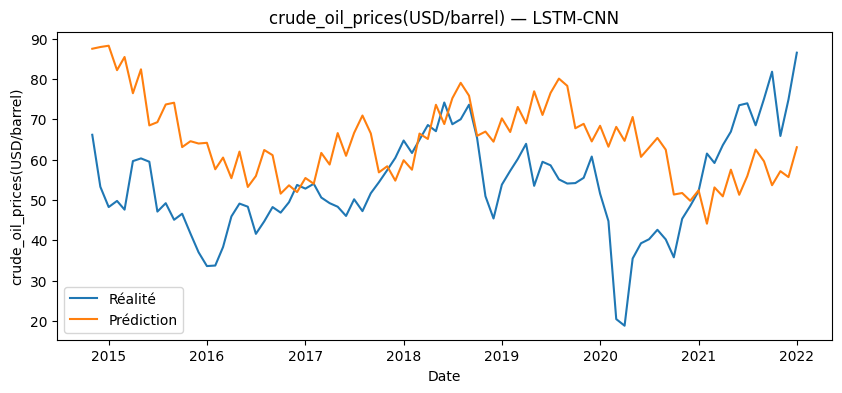
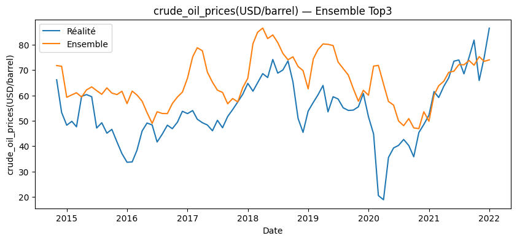
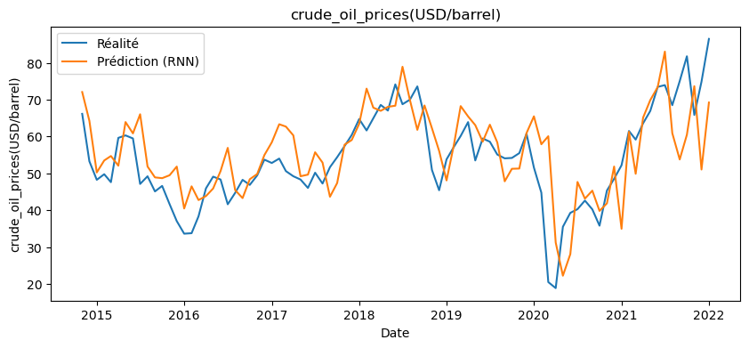
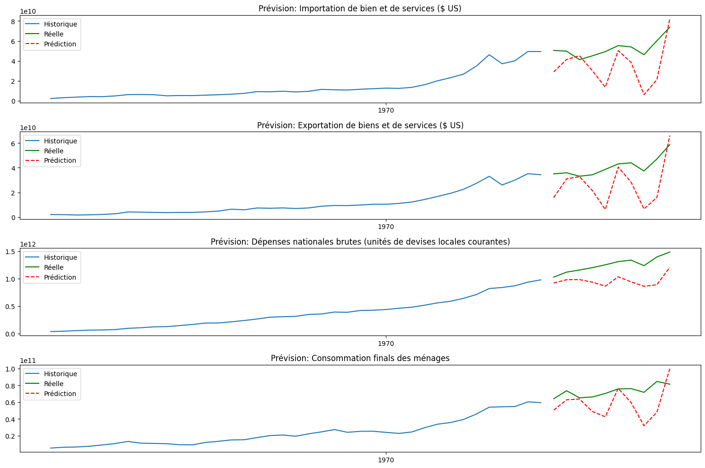

==========================
Approaches and Models Used
==========================

This project focuses exclusively on **deep learning models** tailored for time series forecasting. Each model is selected for its ability to capture temporal dependencies and its suitability for various types of economic time series data. Below is a description of the models and the optimization strategies employed.

RNN (Recurrent Neural Network)
------------------------------
The RNN is the foundational model for sequence modeling. It maintains internal hidden states that evolve over time, enabling it to capture sequential dependencies. However, due to its simple structure, it suffers from limitations like the *vanishing gradient problem*, which affects its ability to model long-term dependencies in economic time series.

LSTM (Long Short-Term Memory)
-----------------------------
LSTM networks address RNN limitations by introducing memory cells and gating mechanisms (input, forget, and output gates). These allow the model to retain and selectively forget information across long time steps, making it suitable for capturing persistent economic patterns over time, such as cyclical trends or delayed responses to market events.

BiLSTM (Bidirectional LSTM)
---------------------------
The BiLSTM architecture enhances the standard LSTM by processing sequences in both forward and backward directions. This dual perspective allows the model to utilize both past and future context in its predictions, which is particularly beneficial for indicators influenced by both prior trends and anticipated policy shifts or seasonality.

LSTM-CNN Hybrid
---------------
This hybrid architecture combines **convolutional layers** for automatic local feature extraction with LSTM layers to model global temporal dependencies. The CNN layers capture short-term patterns and noise in the economic data (e.g., market shocks), while LSTM handles long-term dependencies, resulting in a more robust and hierarchical forecasting model.

GRU (Gated Recurrent Unit)
--------------------------
GRU is a simplified version of LSTM, utilizing only two gates (reset and update). It requires fewer parameters and training time while achieving performance comparable to LSTM. GRUs are particularly useful when computational efficiency is a concern, or when the time series has moderate temporal complexity.

TCN (Temporal Convolutional Network)
------------------------------------
TCNs use **causal and dilated convolutions** to model temporal dependencies without recurrence. By stacking multiple layers with increasing dilation factors, TCNs can capture both short- and long-range dependencies in parallel, making them highly efficient for long time series forecasting. They also offer stable gradients and improved convergence.

Transformer
-----------
Transformers leverage **self-attention mechanisms** to dynamically weigh the relevance of different time steps in a sequence. Unlike RNN-based models, Transformers do not require sequential processing, allowing for greater parallelism and scalability. This architecture is powerful in modeling complex interdependencies between variables across long time horizons.

Optimization Strategy
---------------------
To ensure optimal performance for each economic indicator, all models were systematically tuned using **Optuna**, a state-of-the-art *automated hyperparameter optimization* framework.

Key elements of the strategy included:

- **Search Space Design**: Defined ranges for critical hyperparameters such as learning rate, batch size, number of layers, hidden units, dropout rates, and sequence lengths.
- **Cross-Validation**: Time series-aware *k-fold cross-validation* was used to prevent information leakage and evaluate model robustness over different time slices.
- **Pruning and Early Stopping**: Optuna's pruning capabilities helped terminate underperforming trials early, improving search efficiency.
- **Model-specific Objectives**: Customized objective functions were defined for each model type, considering performance metrics such as RMSE and MAE.
- **Hardware Acceleration**: Optimization was parallelized across GPUs where available to reduce training time.

This rigorous tuning process allowed each model to be evaluated under fair and optimized conditions, enabling reliable comparison and model selection.

Forecasting Strategies
----------------------

In addition to evaluating individual deep learning models, this project explored three distinct forecasting strategies to determine the most effective method for economic time series prediction:

1. *Global Best Model Strategy*  
   In this approach, a single model—the one that achieved the best overall performance across all indicators—was selected to forecast every economic indicator in the dataset. This strategy emphasizes simplicity and uniformity, reducing complexity in deployment and maintenance.

Check the notebook: `Global Best Model Notebook <../Notebooks/global-best-modelipynb>`_

2. *Model Averaging Strategy*  
   The second approach uses the *average predictions* of the three top-performing models . By aggregating forecasts, this ensemble method aims to balance the strengths of different architectures, reduce variance, and improve generalization on unseen data.

Check the notebook: `Top 3 models Notebook <../Notebooks/Top3_avr_models.ipynb>`_

3. *Indicator-specific Best Model Strategy*  
   The final and most granular approach assigns the *best-performing model for each individual indicator*. This method leverages the unique characteristics of each economic series, ensuring that model architecture aligns closely with the temporal complexity and behavior of the data it forecasts.

Check the notebook: `by indicator Notebook <../Notebooks/best-model_for-each-indicator copie.ipynb>`_

4. *Correlation-based Group Modeling Strategy*  
   In this advanced approach, economic indicators are first grouped based on *pairwise correlation analysis. Indicators that exhibit strong temporal correlation (positive or negative) are clustered together and modeled jointly using a shared architecture. This allows the model to learn from **cross-indicator dependencies*, capture co-movements, and benefit from multivariate patterns—especially relevant in macroeconomic systems where variables influence one another (e.g., inflation and interest rates).

Check the notebook: `Correlation Grouping Notebook <../Notebooks/correlation_grouping.ipynb>`_

By comparing results from these four strategies, we were able to assess not only the standalone performance of each model, but also the effectiveness of various deployment schemes in multi-indicator forecasting scenarios.
