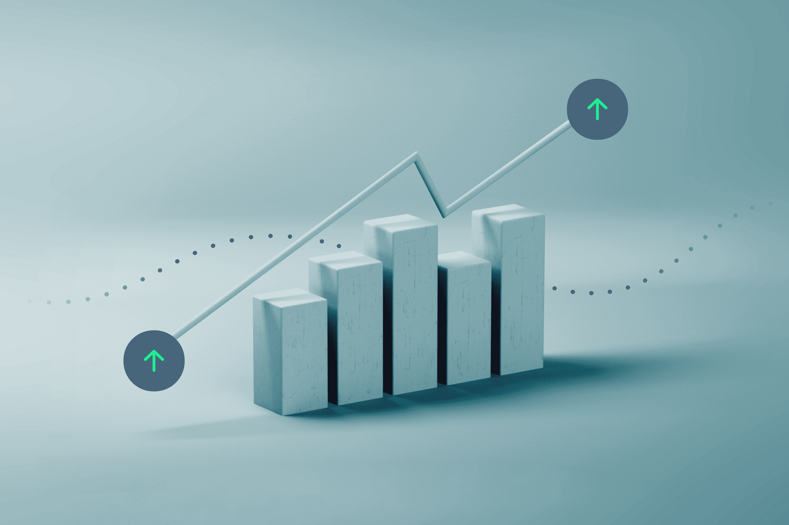

Introduction
============

In an increasingly data-driven world, the ability to anticipate economic trends is vital for governments, businesses, and financial institutions. This project focuses on designing a **robust time series forecasting system** capable of predicting **key economic indicators**—such as GDP growth, inflation, unemployment rates, and industrial production—based on historical data patterns.

The system will rely on a combination of **deep learning techniques** and **advanced data preprocessing** to generate **accurate short- and medium-term forecasts**. These predictions are expected to support analysts and decision-makers in understanding complex economic dynamics and in making **informed, data-backed decisions**.

The primary goals of this project are as follows:

- To **collect and preprocess** economic time series data from reliable sources.  
- To **build and train various forecasting models**, including traditional statistical methods and modern deep learning architectures such as LSTM (Long Short-Term Memory) networks, GRU (Gated Recurrent Units), and Transformer-based models.  
- To **tune and optimize** these models for performance and generalizability.  
- To **compare forecasting accuracy** across different models using standard metrics like MAE (Mean Absolute Error), RMSE (Root Mean Squared Error), and MAPE (Mean Absolute Percentage Error).  
- To **identify the best-performing model** for each economic indicator and provide interpretable insights.

Ultimately, this project aims to bridge the gap between theoretical model development and practical forecasting application in economics. The results can serve as a valuable tool for forecasting economic changes and shaping policy or investment strategies accordingly.
