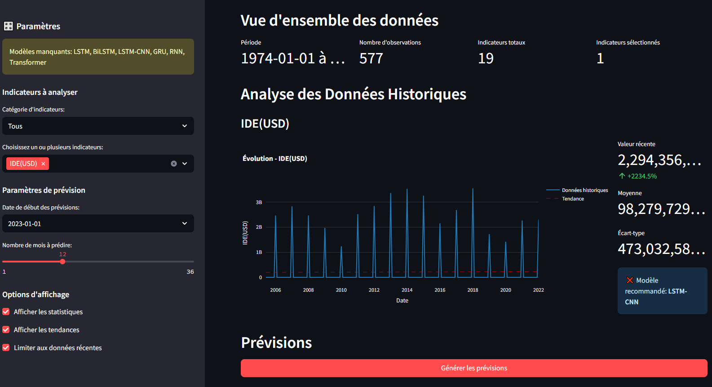

================================
Test Interface
================================

Check the notebook: `interface Notebook <../Notebooks/streamlit_app_simple.ipynb>`_

Overview
========

The application supports multiple economic indicators including foreign direct investment (FDI), inflation rates, unemployment statistics, commodity prices, and various socio-economic metrics specific to Morocco's economy.

Features
========

Core Functionality
------------------

* **Interactive Data Visualization**: Dynamic charts and graphs for historical economic data
* **Multi-Model Forecasting**: Support for various deep learning models (LSTM, BiLSTM, GRU, RNN, CNN-LSTM, Transformer)
* **Categorical Analysis**: Organized indicators by economic, commodity, social, and trade categories
* **Comparative Analysis**: Side-by-side comparison of multiple economic indicators
* **Flexible Time Horizons**: Customizable forecasting periods from 1 to 36 months
* **Real-time Statistics**: Live computation of statistical metrics and trends

Supported Economic Indicators
-----------------------------

**Economic Indicators**
  * Foreign Direct Investment (FDI) in USD
  * Real Effective Exchange Rate (REER, 2010 = 100)
  * Inflation rate (annual %)
  * Total unemployment rate (% of population)
  * Youth unemployment rate (15-24 years, % of population)

**Commodity Indicators**
  * Brent oil prices (USD/barrel)
  * Crude oil prices (USD/barrel)
  * Daily natural gas prices (USD/MMBtu)
  * Annual gold prices (USD/oz)
  * Wheat production (Million Bushels)

**Social Indicators**
  * Demographics
  * Poverty rates
  * Illiteracy rates
  * Household final consumption

**Trade Indicators**
  * International tourism receipts (USD)
  * Export of goods and services (USD)
  * Import of goods and services (USD)
  * Gross national expenditure (local currency units)

Installation
============

Prerequisites
-------------

Before installing **M-eco**, ensure you have the following installed:

- Python 3.7 or higher.  
  You can check your version using::

    python --version

Required Dependencies
---------------------

The core functionality of **M-eco** depends on the following packages:

- **streamlit** >= 1.0.0  
  For building interactive web applications.
- **pandas** >= 1.1.0  
  For data analysis and manipulation.
- **numpy** >= 1.18.0  
  For numerical computations.
- **plotly** >= 5.0.0  
  For creating interactive visualizations.

Install the required dependencies with::

    pip install streamlit>=1.0.0 pandas>=1.1.0 numpy>=1.18.0 plotly>=5.0.0

Optional Dependencies (for Advanced Features)
---------------------------------------------

To enable machine learning and deep learning capabilities, install the following additional packages:

- **tensorflow** >= 2.3.0  
  For building and training deep learning models.
- **scikit-learn** >= 0.24.0  
  For preprocessing, model selection, and classical machine learning.

Install optional dependencies with::

    pip install tensorflow>=2.3.0 scikit-learn>=0.24.0

Alternatively, to install all dependencies at once::

    pip install -r requirements.txt

Quick Start
-----------

1. Clone or download the application files
2. Ensure your data file ``Dataset_Timeseries.csv`` is in the same directory
3. Install the required dependencies
4. Run the application using Streamlit
5. Open your web browser and navigate to the provided local URL

Usage Guide
===========

Getting Started
---------------

1. **Launch the Application**
   
   Start the Streamlit app and navigate to the web interface.

2. **Data Loading**
   
   The application automatically loads the dataset file on startup.

3. **Select Indicators**
   
   Use the sidebar to choose from categorized economic indicators.

4. **Configure Analysis**
   
   Set your analysis parameters including forecast horizon and display options.

Interface Components
--------------------

Sidebar Controls
~~~~~~~~~~~~~~~~

The sidebar provides access to all configuration options:

* **Parameters**: Main configuration section
* **Indicators to Analyze**: Category selection and multi-select indicators
* **Forecast Parameters**: Start date and forecast periods configuration
* **Display Options**: Statistics, trends, and data limiting controls

Main Dashboard
~~~~~~~~~~~~~~

The main interface displays:

* **Overview Statistics**: Data period, observations count, available indicators
* **Historical Analysis**: Interactive charts with trend lines and statistical metrics
* **Forecasting Results**: Predicted values with model information
* **Comparative Analysis**: Multi-indicator comparison charts

Forecasting Methods
===================

Model Selection Strategy
------------------------

The application uses an intelligent model selection system that automatically assigns the optimal model to each economic indicator based on performance benchmarks and data characteristics.

Fallback Methods
----------------

When deep learning models are unavailable, the system uses:

* **Linear Extrapolation**: Based on recent trends
* **Statistical Smoothing**: Moving averages and trend decomposition
* **Noise Injection**: For realistic variance in predictions

Data Format and Requirements
============================

Input Data Structure
--------------------

The application expects a CSV file named ``Dataset_Timeseries.csv`` with time series data where:

* First column contains dates
* Subsequent columns contain economic indicator values
* Data should be regularly spaced (monthly frequency recommended)

Data Preprocessing
------------------

The application automatically handles:

* **Date parsing and indexing**
* **Numeric conversion** with special character removal
* **Missing value imputation** using forward/backward fill
* **Data validation** and error reporting

Quality Checks
--------------

* Automatic detection of data inconsistencies
* Missing value reporting
* Data completeness statistics
* Model availability verification

Configuration Options
=====================

Display Settings
----------------

Users can customize the interface through various options:

* **Show Statistics**: Toggle statistical metrics display
* **Show Trends**: Enable/disable trend line visualization
* **Limit to Recent Data**: Focus on recent observations for better performance

Forecast Configuration
----------------------

* **Forecast Start Date**: Beginning date for predictions
* **Forecast Periods**: Number of months to predict (1-36 months)
* **Indicator Categories**: Filter indicators by economic type

Advanced Features
=================

Multi-Indicator Analysis
------------------------

The application supports simultaneous analysis of multiple economic indicators with:

* Synchronized visualization
* Comparative forecasting
* Normalized comparison charts
* Cross-correlation analysis

Model Performance Tracking
---------------------------

* Automatic model recommendation per indicator
* Performance metrics display
* Model availability status
* Fallback method notification

Export and Reporting
---------------------

* Detailed forecast tables
* Statistical summaries
* Interactive chart exports
* Comparative analysis results

Troubleshooting
===============

Common Issues
-------------

**Data Loading Problems**
  Ensure the CSV file is properly formatted and located in the correct directory.

**Missing Dependencies**
  Install all required packages, especially for advanced forecasting features.

**Model Loading Failures**
  Check that model files are present and compatible dependencies are installed.

**Performance Issues**
  For large datasets, enable data limiting options or reduce the number of selected indicators.

**Memory Limitations**
  Use recent data filtering and limit concurrent forecasting operations.
