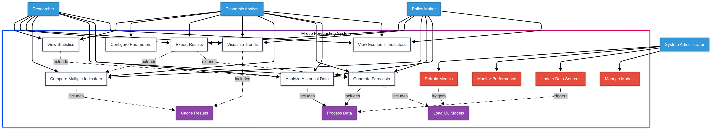
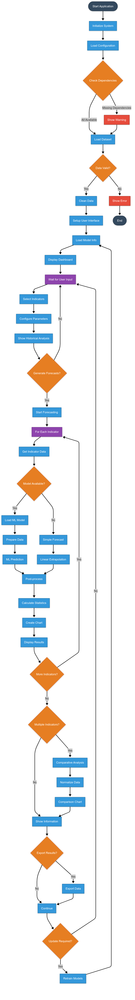

System Architecture and Design
==============================

This section provides a comprehensive overview of the system's architecture and its main behavioral and structural aspects through multiple UML diagrams.

Overview
--------

The design includes:

- A **Use Case Diagram** to describe the external interaction with the system.
- An **Activity Diagram** to illustrate the internal logical flow.
- A **Sequence Diagram** for communication flow between components.
- A **Class Diagram** to define the internal structure of the system.

Use Case Diagram
----------------

The use case diagram highlights the interactions between the user and the system features:

   Figure 1: Use case diagram showing the functional scope of the system.

Activity Diagram
----------------

The activity diagram provides a high-level view of the logical execution steps:

   Figure 2: Activity diagram representing the system’s operational flow from start to result presentation.

Sequence Diagram
----------------

The sequence diagram shows how system components interact over time during a forecasting request:

.. figure:: images/sequence.png
   :alt: Sequence Diagram
   :align: center
   :width: 90%

   Figure 3: Sequence diagram illustrating the time-ordered communication between components during a user-initiated forecast.

Class Diagram
-------------

The class diagram defines the internal structure, showing how components and classes are related:

.. figure:: images/class.png
   :alt: Class Diagram
   :align: center
   :width: 90%

   Figure 4: Class diagram representing the modular structure of the application.

Conclusion
----------

These UML diagrams help provide a clear, organized understanding of both the system architecture and its dynamic behavior, facilitating implementation, testing, and future enhancements.
